

<!-- PROJECT LOGO -->
 

<h3 align="center">마케팅 데이터 분석</h3>

  

    Python을 이용한 통계적, 퍼널, 코호트, RFM 분석 및 시각화
  

<!-- TABLE OF CONTENTS -->

  
Table of Contents

  <ol>
    <li>
      <a href="#프로젝트-개요">프로젝트 개요</a>
      <ul>
        <li><a href="#📊-분석-방향">분석 방향</a></li>
        <li><a href="#📝-결론">결론</a></li>
      </ul>
    </li>
    <li>
      <a href="#프로젝트-과정">프로젝트 과정</a>
      <ul>
        <li><a href="#문제-소개">문제 소개</a></li>
        <li><a href="#전처리">전처리</a></li>
        <li><a href="#통계적-분석">통계적 분석</a></li>
          <ul>
            <li><a href="#상품-전환율-(CVR)">상품 전환율 (CVR)</a></li>
            <li><a href="#카테고리별-매출-(CAGR)">카테고리별 매출 (CAGR)</a></li>
            <li><a href="#카테고리별-월평균-매출-추이">카테고리별 월평균 매출 추이</a></li>
            <li><a href="#Z-차트">Z 차트</a></li>
            <li><a href="#ABC-매출-등급-분석">ABC 매출 등급 분석</a></li>
            <li><a href="#구매주기-경과-고객-추출-(CRM)">구매주기 경과 고객 추출 (CRM)</a></li>
          </ul>
        <li><a href="#퍼널-분석">퍼널 분석</a></li>
        <li><a href="#코호트-분석">코호트 분석</a></li>
        <li><a href="#RFM-분석">RFM 분석</a></li>
      </ul>
    </li>
  </ol>

<!-- ABOUT THE PROJECT -->
## 프로젝트 개요 
소매 업체의 거래 내역, 고객 정보, 소매 카테고리 데이터를 이용한 마케팅 데이터 분석 프로젝트

### 📊 분석 방향
- 데이터 수집: Kaggle 데이터셋에서 소매 업체 거래 로그 데이터
- https://www.kaggle.com/datasets/darpan25bajaj/retail-case-study-data
- 기본 분석: 상품 전환율 (CVR), 카테고리별 기하평균 (CAGR), Z 차트, ABC 매출 등급, 구매주기 경과 고객 (CRM)
- 추가 분석: **퍼널, 코호트, RFM 분석**

### 📝 결론
새로운 피쳐 중 1hr lag의 중요도가 매우 높았으며, 시간의 영향을 많이 받는 것으로 나타났다.\
 
베이스라인 생성 이후, 수요 예측을 해결하기 위한 추가 모델링 모델의 경우 베이스라인에 비해서 수요 예측이 더 정확해진 것을 확인할 수 있다.

(<a href="#readme-top">back to top</a>)

<!-- GETTING STARTED -->
## 프로젝트 과정

### 문제 소개

<table align="center">
  <tr>
    <th>문제 발견</th>
    <td>소매 데이터를 분석하여 기업 리포트 작성 필요</td>
  </tr>
  <tr>
    <th>데이터 소개</th>
    <td>2011~2013년 거래 내역, 고객 정보, 소매 카테고리 데이터</td>
  </tr>
  <tr>
    <th>목표 설정</th>
    <td>기업 리포트 작성 및 RFM을 활용해 고객 등급 세분화</td>
  </tr>
  <tr>
    <th>기대 효과</th>
    <td>각 고객 세그먼트 타겟별로 마케팅을 차별화하여 수익 극대화</td>
  </tr>
</table>

(<a href="#readme-top">back to top</a>)

### 전처리

1. 이상치/결측치 데이터 처리
    - transaction_id가 3개 이상인 row 제거
    - 결측치는 최빈값 혹은 새로운 범주를 만들어 해결
2. 거래 내역과 소매 카테고리 데이터 조인

(<a href="#readme-top">back to top</a>)

### 통계적 분석

#### 상품 전환율 (CVR)
- Q1: 고관여 상품군의 상품 전환율은 더 높은가?
- A1: (그래프 1.1 참고)
    - 상품 전환율이 높은 대 카테고리는 "Electronics"이며 서브 카테고리는 "Audio and video"이다
    - 이는 고관여 상품으로 분류되는 Electronics 카테고리가 상품 전환율이 크다라는 가설을 뒷받침 할 수 있는 근거이다.
    - 하지만 상품 전환율이 가장 높은 카테고리와 낮은 카테고리의 차이가 **5.6%**로 그 차이가 작고, 평균과의 편차도 작은 편이다.
    - 그러므로 카테고리간의 상품 전환율 차이가 유의미하다고 보기 힘들다.

  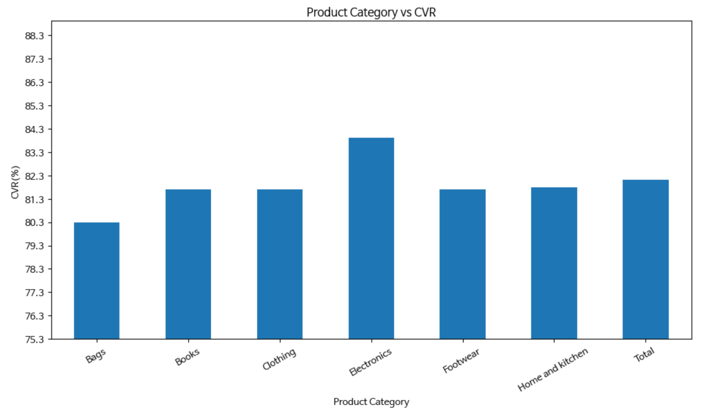
  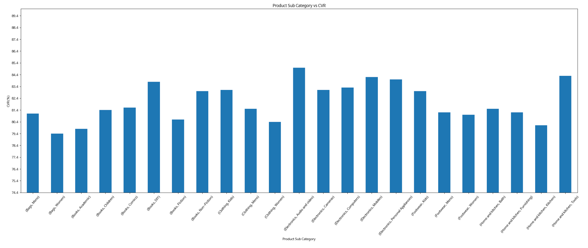

(그래프 1.1)

- Q2: 상품 전환율이 높았던 "Electronics" 카테고리가 다른 카테고리 대비 평균 판매가가 높은가 (고관여 상품인가)?
- A2: (그래프 1.2 참고)
    - 고관여 상품군인 "Electronics"의 평균 판매가는 다른 카테고리의 평균 판매가 대비 높지 않다.
        - Electronics (Audio and video)의 상품 전환율은 1위이지만 평균 판매가는 20위이다\
 
- Q3: 평균 판매가와 상품 전환율 간 관계가 존재하는가?
- A3: (그래프 1.2 참고)
    - 평균 판매가와 상품 전환율 간 특별한 상관 관계가 보이지 않는다

  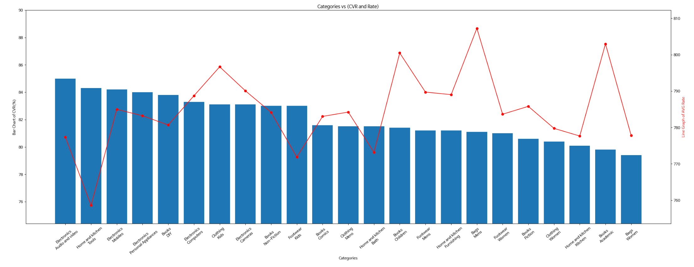

(그래프 1.2)

(<a href="#readme-top">back to top</a>)

#### 카테고리별 매출 (CAGR)
- 각 카테고리의 매해의 매출액 성장률

| Category           | 매출액 성장률(%)    |
|-----------------------|--------|
| Bags      | 1.64 |
| Books          |  -0.09 |
| Clothing         |  5.78 |
| Electronics |  2.25 |
| Footwear |  2.36 |
| Home and kitchen |  2.86 |

- 결과 해석
  - 2011년부터 2013년까지의 카테고리별 CAGR를 구했을 때 **Clothing** 카테고리가 **5.78%** 로 매출액 성장률이 제일 높았으며, **Book** 카테고리가 **-0.09%** 로 성장률이 제일 저조했다.

(<a href="#readme-top">back to top</a>)

#### 카테고리별 월평균 매출 추이
- Q1: 가장 월평균 매출익이 높은 카테고리는?
- Q2: 카테고리별 월평균 매출액의 분산과 표준 편차는?
- Q3: RSD(변동계수)를 이용한 해석?

| Category         | Mean       | Variance     | Std. Deviation |   RSD |
|------------------|------------|--------------|---------------:|------:|
|             Bags | 109989.613 | 6.715918e+08 |   25915.087426 | 0.236 |
|            Books | 341885.312 | 3.031870e+09 |   55062.414974 | 0.161 |
|         Clothing | 166151.913 | 1.618094e+09 |   40225.533948 | 0.242 |
|      Electronics | 286007.580 | 2.632264e+09 |   51305.597839 | 0.179 |
|         Footwear | 166962.400 | 1.287442e+09 |   35880.941662 | 0.215 |
| Home and kitchen | 224803.011 | 1.769892e+09 |   42070.081901 | 0.187 |

- 결과 해석
  - 월매출 평균이 제일 높은 카테고리는 Books 카테고리이며, 제일 낮은 카테고리는 Bags 카테고리이다.
  - 표준 편차로만 보았을 때 Book 카테고리의 매출액 변동성이 가장 큰 것처럼 보이지만 RSD를 이용하였을 때는 Book 카테고리는 매출액 변동성이 낮으면서 월평균 매출액이 가장 큰 카테고리다.
  - **따라서 Books 카테고리가 매출에 기여도가 크면서 안정적으로 매출이 발생하는 주력 카테고리라고 해석된다.**

(<a href="#readme-top">back to top</a>)

#### Z 차트
- 2013년 매출추이의 월별 매출, 누계 매출, 이동 합계

  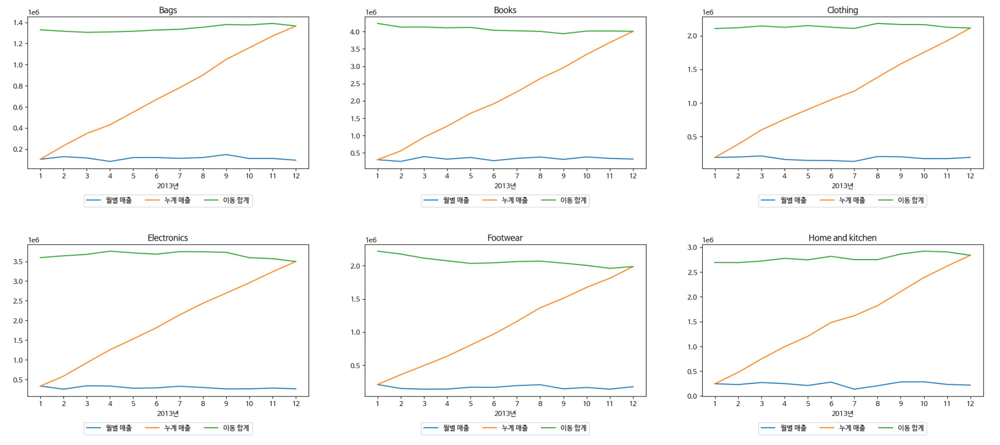

(그래프 1.3)

- 결과 해석
  - Bags와 Home and kitchen 카테고리는 점차적으로 매출이 **상승**
  - Clothing과 Electronics는 월별로는 차이가 있지만 전반적으로 매출이 **보합세**
  - Books와 Footwear는 연초보다 연말에 매출이 **하락**

(<a href="#readme-top">back to top</a>)

#### ABC 매출 등급 분석
- 2013년 매출 등급 (누적 구성비 기준)
  - A 등급: 상위 50%
  - B 등급: 상위 80%
  - C 등급: 상위 100%

  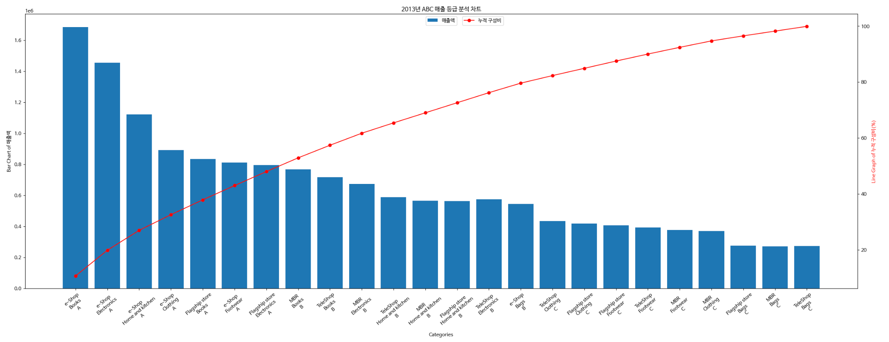

(그래프 1.4)

- 결과 해석
  - 총 매출의 50%를 차지하는 A등급 카테고리는 총 7개로 그 중 5개는 온라인 **e-shop**에서 발생
  - 그 중 e-shop에서 생긴 **Books** 카테고리는 구성비가 10.7%를 차지하며 제일 **매출 기여도가 높다**
  - 판매 촉진을 위한 광고비를 지출해야 한다면, **e-shop**에서의 광고, 특히 주력 카테고리인 **Books**와 **Electronics**을 **중심**으로 예산을 편성하여 운영
  - 균형있는 매출을 위해 **Bags**와 **Footwear** 카테고리에 대해 **매출 활성화 전략** 필요

(<a href="#readme-top">back to top</a>)

#### 구매주기 경과 고객 추출 (CRM)
- 2013년 매출 등급 (누적 구성비 기준)
  - 현재 날짜가 2014.03.01이라고 가정
  - 각 고객의 구매주기 계산

  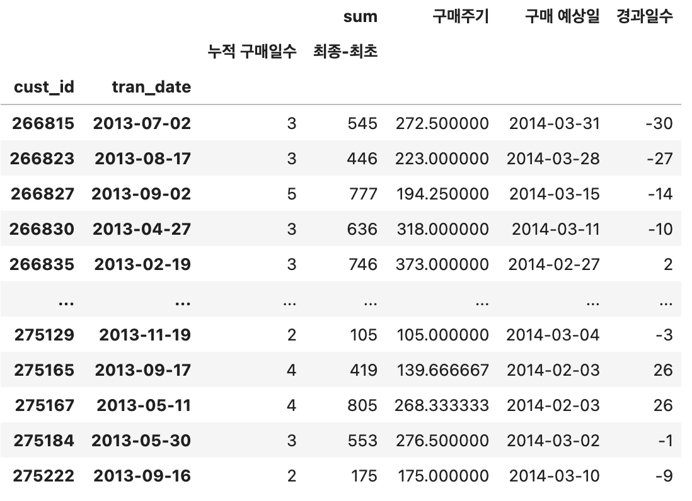

(그래프 1.5)

- 결과 해석
  - 구매 예상일 경과일수가 30일 전후인 고개들만 추출한 결과 총 **486**명이 추출됨
  - 해당 고객들에게 푸쉬 알림을 보내 **구매 전환을 유도**

(<a href="#readme-top">back to top</a>)

### 퍼널 분석
- 전체 서비스에 가입한 고객중 2013년 하반기 (7월~12월) 기간 동안 구매한 고객과 상품을 취소하지 않고 구매를 확정한 고객의 퍼널별 실적 차트

  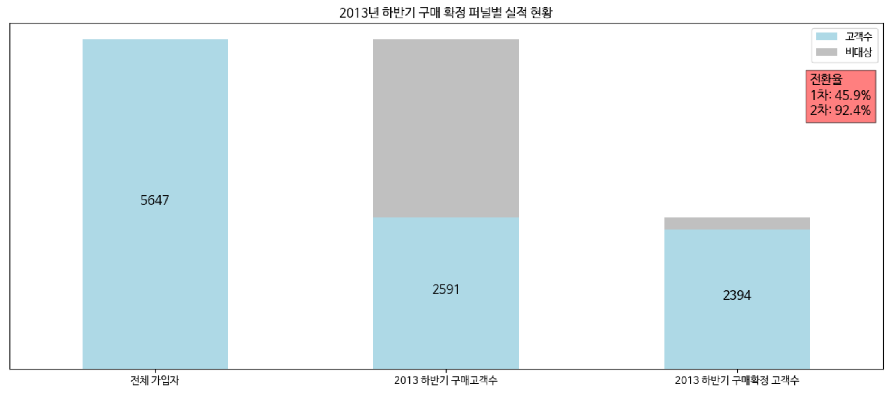

(그래프 2.1)

- 결과 해석
  - 2013년 하반기에는 첫번째 퍼널에서 전체 가입자 중 **45.9%** 에 해당하는 2591명이 **구매로 전환**되었고 두번째 퍼널에서 그중 **92.4%** 에 해당하는 2394명이 **구매확정으로 전환**되었다

(<a href="#readme-top">back to top</a>)

### 코호트 분석
- 2012년 각 고객이 첫구매한 월을 기준으로 코호트 생성
- 첫구매 이후 경과월수별 평균 구매 유지율 코호트 분석

  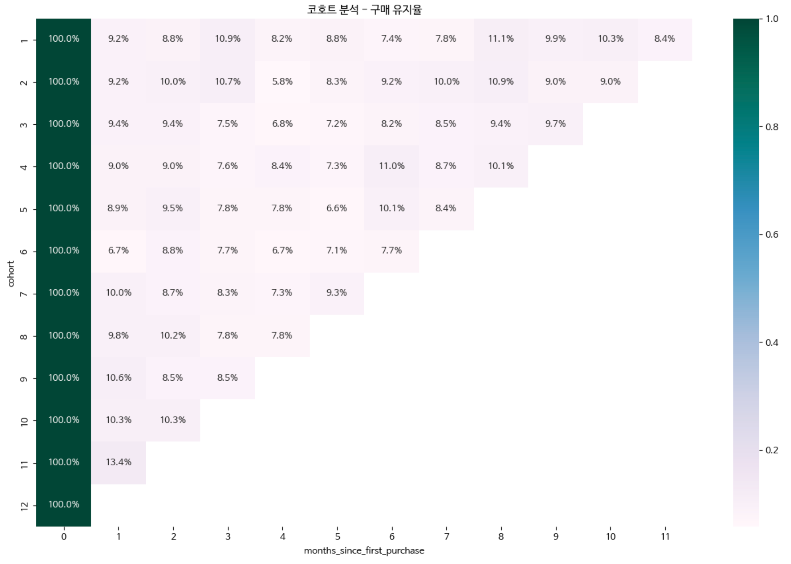
  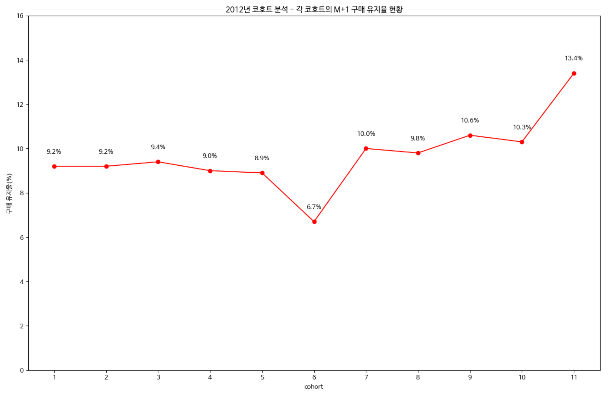

(그래프 3.1)

- 결과 해석
  - 2012년 1~5월까지 M+1 구매 유지율이 약 9% 내외
  - 6월은 6.7%로 연중 최저치 기록
  - 7~10월까지 구매 유지율이 10%를 상회하며 다시 회복
  - 11월 코호트의 경우 연중 최고치 기록\
   
  - 해당 코호트 분석결과 2012년 하반기 재구매 증가로 구매 유지율이 크게 개선되었음을 보여준다. 이 당시 서비스의 어떤 부분이 이 결과를 이끌어냈는지 분석 필요

(<a href="#readme-top">back to top</a>)

### RFM 분석
- Class: 1등급에서 5등급으로 총 5개의 구간으로 설정
- 1등급: recency가 가장 최근이고, frequency와 monetary가 가장 높은 고객
- RFM 각 요소별 매출 기여도에 따른 RFM의 가중치 계산
  - RFM 스코어가 낮을수록 우수 고객

  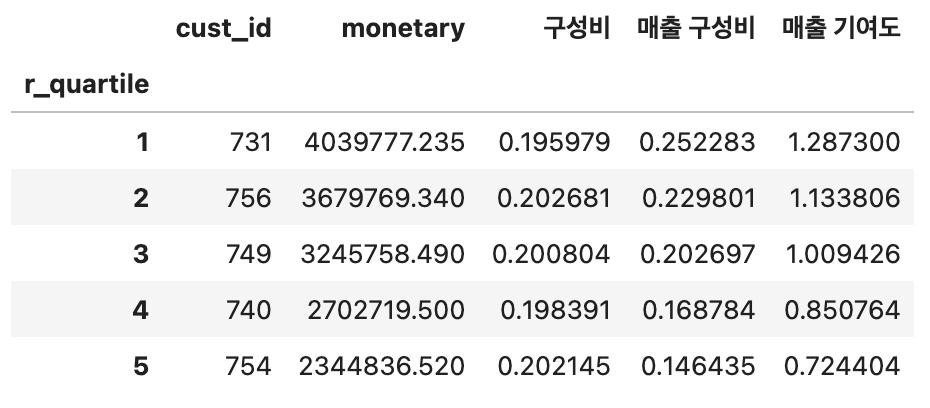
  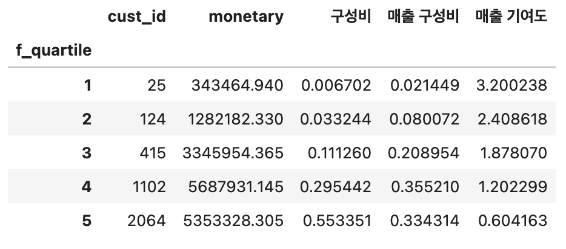
  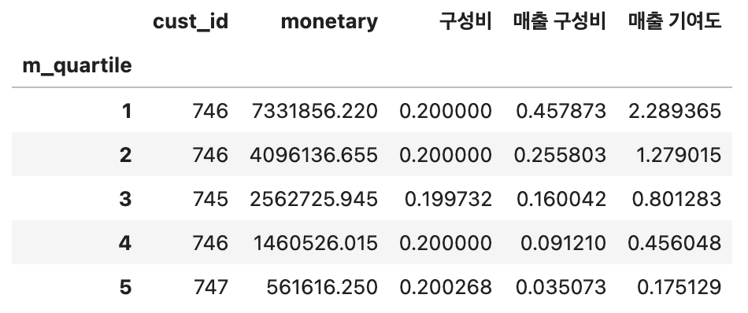

(그래프 3.1)

|        | R     | F     | M     |
|--------|-------|-------|-------|
| Weight | 0.259 | 0.481 | 0.259 |

(표 3.2)

  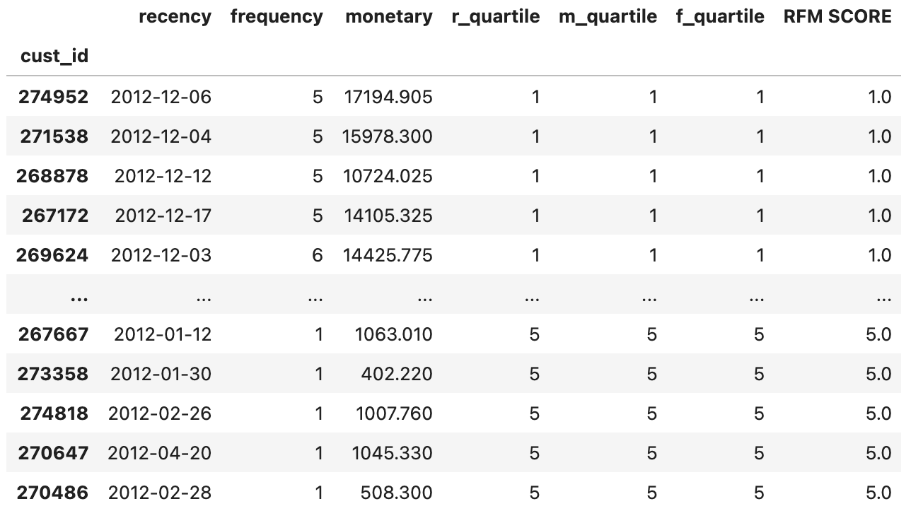

(그래프 3.3)

- 결과 해석
  - 고객 Class별 차별화된 마케팅 전략으로 우수 고객수를 유지 시키고 점수가 낮은 고객은 충성 고객으로 전환시킨다

(<a href="#readme-top">back to top</a>)

